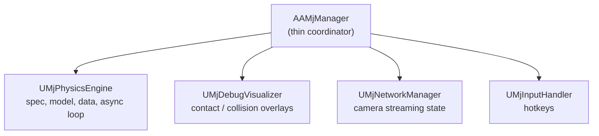
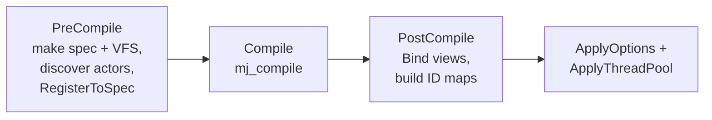
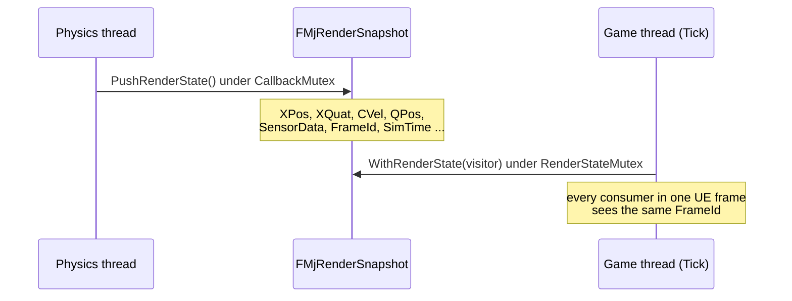

# Architecture

How URLab embeds MuJoCo inside Unreal Engine: the manager and its subsystems, the compile and step pipeline, the physics thread and render-snapshot handoff, and the networking transports that let external clients drive the sim.

This page is about the engine internals. The Python-facing wire frames (msgpack envelope, op names, payload schemas) live in [Protocol Reference](../reference/protocol.md); this page links there for wire details and stays focused on what runs inside the plugin.

## The manager and its subsystems

`AAMjManager` is the top-level coordinator actor. It owns no simulation state of its own. Instead it creates four `UActorComponent` subsystems in its constructor (via `CreateDefaultSubobject`) and delegates to them.

| Subsystem | File | Responsibility |
|---|---|---|
| `UMjPhysicsEngine` | `Source/URLab/Public/MuJoCo/Core/MjPhysicsEngine.h` | Owns `m_spec`, `m_vfs`, `m_model`, `m_data`. Runs the compile pipeline and the async step loop. Exposes step-callback registration. |
| `UMjDebugVisualizer` | `Source/URLab/Public/MuJoCo/Core/MjDebugVisualizer.h` | Captures contact data on the physics thread, renders overlays on the game thread. |
| `UMjNetworkManager` | `Source/URLab/Public/Transport/NetworkManager.h` | Tracks camera registration and the global camera-streaming toggle. |
| `UMjInputHandler` | `Source/URLab/Public/MuJoCo/Input/MjInputHandler.h` | Processes simulation hotkeys and dispatches to the other subsystems. |

Subsystems communicate three ways: step callbacks on `UMjPhysicsEngine` (`RegisterPreStepCallback` / `RegisterPostStepCallback`), sibling lookup via `GetOwner()->FindComponentByClass<T>()`, and direct property access (for example `Manager->PhysicsEngine->Options`). `AAMjManager` keeps no duplicate state; its Blueprint-callable helpers (`SetPaused`, `StepSync`, `ResetSimulation`) forward to `PhysicsEngine`.

## Component model

Every MJCF element type maps to a `UMjComponent` subclass attached to an `AMjArticulation` Blueprint. `UMjComponent` derives from `USceneComponent` and implements `IMjSpecElement`. The component tree mirrors the MJCF body hierarchy.

Two methods drive the lifecycle:

- `RegisterToSpec(wrapper, body)` creates the `mjsElement` during spec construction.
- `Bind(model, data, prefix)` resolves the compiled MuJoCo ID and caches raw pointers into `mjModel` / `mjData` through lightweight View structs (`BodyView`, `GeomView`, `JointView`, and so on, in `MuJoCo/Utils/MjBind.h`).

Imported articulations and user-built articulations both produce the same `UMjComponent` tree and run through the same compile path. See the [Importing guide](../guides/importing.md) and [Articulations guide](../guides/articulations.md) for the authoring side.

## Compile pipeline

Compilation runs once at `BeginPlay` (and again on a recompile request). It is owned by `UMjPhysicsEngine` and proceeds in phases.

1. **PreCompile.** `mj_makeSpec()` creates a fresh spec in radians mode and `mj_defaultVFS()` initialises the virtual file system. The level is scanned with `GetAllActorsOfClass`; each `AMjArticulation`, `UMjQuickConvertComponent`, and `AMjHeightfieldActor` registers its elements. Each articulation builds an isolated child spec, applies its own `SimOptions`, then merges into the root via `mjs_attach()` with an `{ActorName}_` prefix so multi-robot scenes stay namespaced.
2. **Compile.** `mj_compile(m_spec, &m_vfs)` produces `mjModel*`. On failure the error from `mjs_getError` is logged and shown in an editor dialog; `m_model` / `m_data` stay null and the sim does not start. On success `mj_makeData` allocates `mjData`.
3. **PostCompile.** Each component's `Bind()` resolves its ID (by `mjs_getId` with bounds validation, falling back to name lookup) and caches pointers. ID and component maps are built for O(1) runtime access.
4. **Apply options and thread pool.** `ApplyOptions()` writes manager-level overrides into `m_model->opt`; `ApplyThreadPool()` sizes the per-step worker pool (see below).

!!! note "Debug XML"
    With `bSaveDebugXml` enabled, a successful compile also writes `scene_compiled.xml` and `scene_compiled.mjb` to `Saved/URLab/`. Diff the compiled XML against the source MJCF to spot import or default-inheritance mismatches. See the [Debug guide](../guides/debug.md).

## Simulation options

The options struct is `FMjOptionGenerated`, declared in `Source/URLab/Public/MuJoCo/Generated/MjOptionGenerated.h`. It is codegen-owned (a mirror of MuJoCo's `MJOPTION_FIELDS`) and is regenerated on a MuJoCo bump; see [Codegen](../contributing/codegen.md). It appears in two places with different semantics:

- `AMjArticulation::SimOptions` defines the native physics settings for one robot. All fields are written to that articulation's child spec before `mjs_attach()`; the per-field `bOverride_*` toggles are ignored here.
- `UMjPhysicsEngine::Options` (surfaced on the manager) acts as post-compile overrides on `m_model->opt`. Only fields with `bOverride_* = true` are applied, once, after a successful compile.

Resolution order is therefore: MuJoCo built-in defaults, then the articulation's `SimOptions` into its child spec, then the manager's selectively-applied overrides onto the compiled model.

!!! warning "Older struct names"
    Earlier builds used `FMuJoCoOptions` in `MjSimOptions.{h,cpp}`. Those files were removed. The current type is `FMjOptionGenerated`.

## Physics thread and render snapshot

Physics runs on a dedicated async thread launched from `RunMujocoAsync()` via `Async(EAsyncExecution::Thread, ...)`. Each iteration runs under `CallbackMutex` (owned by `UMjPhysicsEngine`):

1. Service pending reset / restore (`mj_resetData` or `mj_setState`, then `mj_forward`).
2. Run registered pre-step callbacks (these drain the inbound control SUB and apply external forces).
3. Apply per-articulation controls into `d->ctrl`.
4. Step: `mj_step(m_model, m_data)`, unless paused, or unless a `CustomStepHandler` is bound (used by replay playback and the direct / puppet network modes).
5. Run registered post-step callbacks (debug capture, snapshot fan-out).
6. Push a render snapshot for the game thread.

After releasing the mutex the loop spin-waits (`FPlatformProcess::YieldThread`) until `TargetInterval / SpeedFactor` has elapsed, so `SimSpeedPercent` controls wall-clock pace.

### Per-step thread pool

`UMjPhysicsEngine::NumWorkerThreads` is an `EditAnywhere` / `BlueprintReadWrite` UPROPERTY (default `0`, meaning single-threaded). `ApplyThreadPool()` calls `mju_threadpool` on the live `mjData` to build or free MuJoCo's internal per-step worker pool. The value is clamped to the logical core count (`MaxWorkerThreads()`). `mju_threadpool` is idempotent, so the pool can be resized at edit time or at runtime through the `set_sim_options` RPC.

### Render snapshot pathway

The game thread must never read `mjData` directly while the physics thread is stepping. Instead the physics thread publishes a coherent snapshot.

`FMjRenderSnapshot` (`Source/URLab/Public/MuJoCo/Core/MjRenderSnapshot.h`) is a single-frame copy of body / geom / site / camera / joint / sensor / flex state plus a monotonic `FrameId`. `PushRenderState()` fills it once per step on the physics thread; `WithRenderState()` holds `RenderStateMutex` for the whole visitor body so all UE-side transform updates in a frame observe one coherent physics frame. This is what drives `UMjBody` transform sync and on-demand transform queries without tearing.

## Thread safety

| Mechanism | Owner | Protects |
|---|---|---|
| `CallbackMutex` (`FCriticalSection`) | `UMjPhysicsEngine` | `m_model` / `m_data` during stepping; held by `StepSync` |
| `RenderStateMutex` (`FCriticalSection`) | `UMjPhysicsEngine` | `FMjRenderSnapshot` during push / visit |
| `DebugMutex` (`FCriticalSection`) | `UMjDebugVisualizer` | contact visualization buffer |
| `CameraMutex` (`FCriticalSection`) | `UMjNetworkManager` | active-camera list |
| `bPendingReset` / `bPendingRestore` / `bShouldStopTask` (`std::atomic<bool>`) | `UMjPhysicsEngine` | cross-thread signals |

## Networking and remote stepping

External Python clients drive physics over a wire. The path splits into a transport-agnostic dispatcher (`FURLabRpcDispatcher`, owned by `UURLabBridgeServer`) plus pluggable transports (ZMQ and shared memory), with manager-owned publishers fanning out one render snapshot per physics tick. The three step modes (`live`, `direct`, `puppet`), both transports, the streaming wire rows, and the threading handoff are covered in [Networking](networking.md).

## Coordinate system

MuJoCo uses right-handed Z-up metres; Unreal uses left-handed Z-up centimetres. Conversions live in `Source/URLab/Public/MuJoCo/Utils/MjUtils.h`:

- Position: `X -> X`, `Y -> -Y`, `Z -> Z`; metres x 100 = centimetres.
- Rotation: MuJoCo quaternion `[w, x, y, z]` maps to an `FQuat` with X and Z negated to flip handedness.

