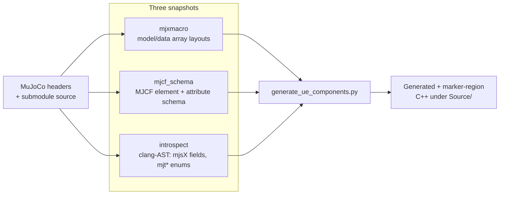

# Codegen

URLab generates most of its MuJoCo component wrappers from MuJoCo's own
headers and schema rather than hand-writing them. This page explains why
that exists and how the pipeline fits together at a high level. For the
contributor how-to (rules, markers, drift gate), see
[Codegen](../contributing/codegen.md).

## Why generate the wrappers

Every MJCF element, option field, enum, and sensor type maps to a UE
type somewhere under `Source/URLab/Public/MuJoCo/`. MuJoCo defines all
of that in its headers, and those definitions move with every release.
Mirroring them by hand means that a routine MuJoCo bump (say 3.6 to 3.7)
turns into days of editing dozens of files, with easy-to-miss omissions
when a new field or sensor type appears.

Codegen inverts that. A version bump becomes one command: rebuild the
snapshots from the new headers, run the generator, ship. The generated
files track MuJoCo's metadata automatically, and a drift diagnostic
surfaces anything new that needs a URLab-side decision. Hand-written
rules cover only those decisions that cannot be derived from MuJoCo's
own metadata.

## The snapshot-driven pipeline

The pipeline runs in two stages: capture MuJoCo's current shape into
snapshots, then feed those snapshots to the generator.



`Scripts/codegen/regen_all.py` orchestrates the whole run: it rebuilds
the three snapshot JSONs under `Scripts/codegen/snapshots/`, then runs
the generator against them. The snapshots are the decoupling point. The
generator never reads MuJoCo headers directly; it reads the captured
snapshots plus URLab's `codegen_rules.json`, which keeps generation
deterministic and reviewable.

## Generated versus hand-written code

Generated output and hand-written logic coexist in the same files. The
boundary is explicit. Codegen-owned regions are fenced with marker
comments:

```cpp
// --- CODEGEN_IMPORT_START ---
// (codegen-emitted, regenerated on every run)
// --- CODEGEN_IMPORT_END ---
```

Everything inside a `// --- CODEGEN_*_START ---` / `// ---
CODEGEN_*_END ---` pair is owned by the generator and replaced on each
regen; everything outside is hand-written and preserved. Some files are
emitted whole as banner-mode artifacts (for example
`MjOptionGenerated.h`). Editing inside a marked region without updating
the corresponding rule means the next regen reverts the change, which is
the most common codegen mistake.

The generator runs **clang-format** over everything it emits, so
generated code matches a clang-format pass across the tree. That makes
the output stable: the build gate can re-run the generator and compare,
and an unformatted or stale emit fails the check before compile time.

## Related

- [Codegen](../contributing/codegen.md): the contributor how-to, with
  the rules file, marker pairs, and the drift gate.
- [Bumping MuJoCo](../contributing/bumping_mujoco.md): the end-to-end
  version-bump procedure.
- [MJCF Support](mjcf_support.md): the coverage this pipeline produces.
