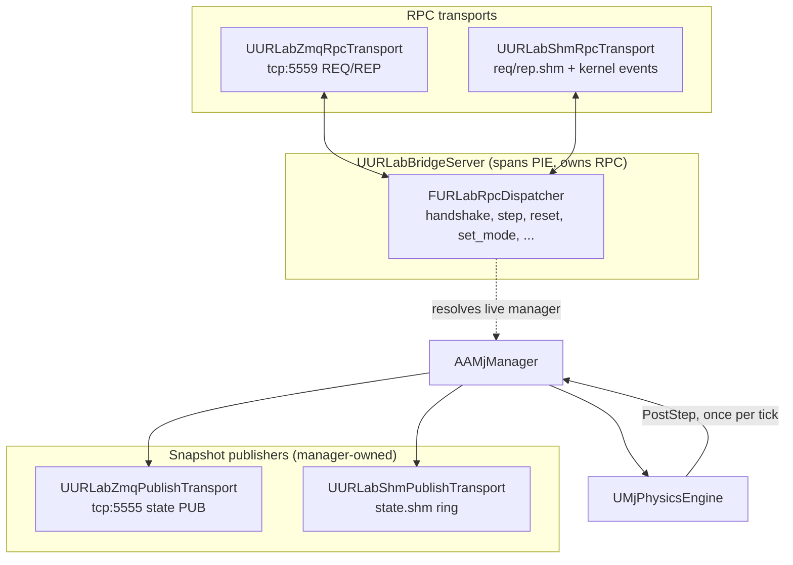
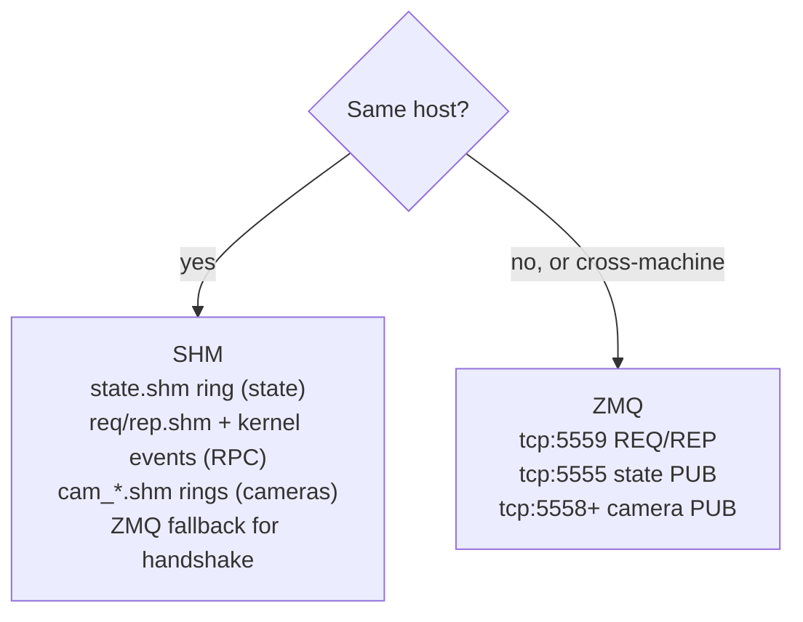

# Networking

How external clients drive the simulation over a wire. URLab splits the
networking layer into a transport-agnostic dispatcher plus pluggable
transports, so the same message frames carry over either ZMQ or
shared memory without the application layer noticing.

This page covers the UE-side architecture: the step modes, the two
transports, the streaming wire rows, and the threading handoff. The
full Python-facing op and error catalogue is in
[Protocol Reference](../reference/protocol.md); the client side is in
[Python Overview](../python/index.md).

## Ownership at a glance

- `FURLabRpcDispatcher` is plain C++ (not a UObject). It holds all
  wire-protocol logic, so several transports share one instance. A
  single mutex on `Dispatch()` serialises concurrent transport access,
  letting ZMQ and SHM coexist.
- `UURLabBridgeServer` owns the dispatcher and every RPC transport. In
  the editor it survives PIE transitions; cooked builds spawn a
  manager-owned bridge in `BeginPlay`.
- Publish streams are manager-owned and live only for the PIE session.
  State snapshots are built once per physics tick by the manager's
  registered PostStep callback and fanned out to every registered
  `IMjSnapshotPublisher`. No double-build.

## Step modes

A session advances physics in one of three modes. The client picks the
mode at handshake time; `AAMjManager.StepMode` can pin the server or
leave it `Auto`. The user-facing version of this choice is in the
[Python Quickstart](../python/quickstart.md).

| Mode | Integrator | Behaviour |
|---|---|---|
| `live` | UE | Physics free-runs at `Options.Timestep`. Publishers fire every tick. A step RPC waits for `n` new snapshots and returns the latest. |
| `direct` | UE | The dispatcher feeds per-articulation `ctrl` from a queue inside the pre-step, then UE runs `mj_step`. Free-run publishers are paused. |
| `puppet` | Client | The client integrates locally; the dispatcher writes the pushed `qpos` / `qvel` and calls `mj_forward` instead of `mj_step`. UE only renders the state. |
| `auto` | n/a | Defers to the server. Auto-promotes to `direct` on the first handshake. |

When `StepMode == Auto`, the client can flip modes mid-session via
`set_mode`. If the project pinned `StepMode`, that RPC returns
`mode_locked_by_server`. The on-wire `set_mode` semantics are in
[Protocol Reference](../reference/protocol.md#set_mode).

## Transports

Two transports carry the same msgpack frames, so the choice is
invisible at the application layer.

### ZMQ (default)

TCP REQ/REP for RPC and PUB/SUB for state and cameras. Works
cross-host, so Python can run on one machine and the editor on another.
UE-side sockets `bind()`; external clients `connect()`. Ports:

| Channel | Port |
|---|---|
| RPC (REQ/REP) | `5559` |
| State (PUB) | `5555` |
| Per-camera (PUB) | `5558+` |

### Shared memory (SHM)

Same-host shared-memory ring buffers (`FMjShmRegion`, mmap-based, with
Windows kernel-event signalling). Lower tail latency than ZMQ,
especially for camera streams. The handshake and any oversize RPC fall
back to ZMQ automatically, so SHM never has to size a region for the
largest possible payload. The handshake carries `shm_session_dir` so
the bridge finds the regions without knowing UE's saved-dir layout.

**When to use which.** Use ZMQ when the client and editor run on
different machines, or as the dependency-light default. Use SHM for
same-host, latency-sensitive control or high-rate camera capture, where
tighter p99 latency matters.

Each `UMjCamera` runs its own ZMQ worker and SHM writer when streaming
is enabled; those paths are independent of the state-snapshot fan-out.
See the [Sensors and Cameras guide](../guides/sensors_cameras.md).

## Streaming wire format

In `live` mode the continuous PUB streams are the channel any
cross-language consumer reads (the ROS 2 bridge included). The rows are
fixed binary, and topics are `{ArticPrefix}/{suffix}`.

| Topic | Source | Row layout |
|---|---|---|
| `{prefix}/base_state/{name}` | `UMjFreeJoint::BuildBinaryPayload` | `13 x float32` (52 bytes): `pos[3]`, `quat[4]` ordered **xyzw**, `linvel[3]`, `angvel[3]` |
| `{prefix}/sensor/{name}` | `UMjSensor::BuildBinaryPayload` | `int32 id`, `int32 dim`, `float[dim]` |
| `{prefix}/joint/{name}` | `UMjJoint::BuildBinaryPayload` | `int32 id`, `float pos`, `float vel`, `float acc` |

!!! warning "Free-joint row format"
    The `base_state` row is 13 float32 values with the quaternion in
    `xyzw` order, and it includes linear and angular velocity. It is not
    7 float64 values and not `wxyz`.

For the full Python-facing wire contract (handshake, step / reset,
runtime mutators, error codes) see
[Protocol Reference](../reference/protocol.md).

## Threading model

The networking layer touches three threads, and the snapshot handoff is
what keeps them from racing.

- **Physics thread.** Runs the async step loop under `CallbackMutex`. A
  registered pre-step callback drains the inbound control queue and
  applies external forces; `mj_step` (or `mj_forward` in puppet mode)
  advances the model; a registered post-step callback builds one render
  snapshot and fans state out to every publisher.
- **Game thread.** Reads the published snapshot under
  `RenderStateMutex` to drive UE-side transforms. It never reads
  `mjData` directly while physics is stepping.
- **Render snapshot handoff.** `FMjRenderSnapshot` is a single-frame
  copy with a monotonic `FrameId`. The physics thread fills it once per
  step; the game thread visits it under the mutex, so every consumer in
  one UE frame sees the same coherent physics frame without tearing.

RPC transports run their own socket-service work and hand decoded
frames to `Dispatch()`, which serialises on its single mutex and
resolves the live manager before touching `mjData`. For the full
internal picture of the compile pipeline and the snapshot pathway, see
[Architecture](architecture.md).

## See also

- [Architecture](architecture.md): engine internals, the options
  struct, the thread pool, the render snapshot.
- [Protocol Reference](../reference/protocol.md): the full wire
  contract.
- [Python Overview](../python/index.md): the client side.
