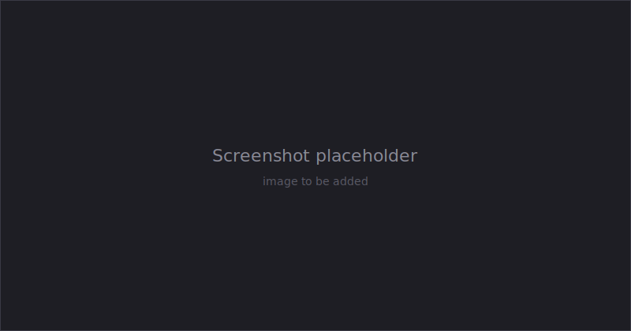

# Articulations

An articulation is a MuJoCo model expressed as an Unreal Blueprint. This guide covers editing one in the Blueprint editor, building one from scratch, and driving it from Blueprint or C++ at runtime.

An `AMjArticulation` holds a tree of MuJoCo components that mirror the MJCF structure. When placed in a level and simulated, URLab converts the tree into a MuJoCo spec, compiles it, and runs physics.



## The component tree

Components are organised into folders under the articulation root:

```
ArticulationRoot
├── worldbody (MjWorldBody)
│   └── body1 (MjBody)
│       ├── Geom_Box (MjBox)
│       ├── HingeJoint (MjHingeJoint)
│       └── body2 (MjBody) ...
└── DefinitionsRoot
    ├── DefaultsRoot      (default classes)
    ├── ActuatorsRoot
    ├── SensorsRoot
    ├── TendonsRoot
    ├── ContactsRoot
    ├── EqualitiesRoot
    └── KeyframesRoot
```

The component's variable name in the tree becomes the MuJoCo element name, so name your components clearly.

## Building from scratch

1. Right-click in the Content Browser, choose **Blueprint Class**, and select `MjArticulation`. Open it.
2. **Add bodies.** In the Components panel, **Add** an `MjBody` as a child of `worldbody`, set its transform, and nest bodies to form kinematic chains (for example upper arm, forearm, hand).
3. **Add geoms.** Select a body and add a geom: `MjBox`, `MjSphere`, `MjCylinder` for primitives, or an `MjMeshGeom` for a static mesh asset. Size primitives with the transform gizmo. See [Geometry & Collision](geometry.md).
4. **Add joints.** Select a body and add `MjHingeJoint`, `MjSlideJoint`, `MjBallJoint`, or `MjFreeJoint`. Configure axis, limits, stiffness, and damping in the Details panel.
5. **Add actuators and sensors.** Add an actuator (for example `MjMotorActuator`) or sensor type. These auto-parent to `ActuatorsRoot` and `SensorsRoot`. Use the **Target** dropdown to pick what each one drives or monitors.

When you add a sensor, actuator, default, tendon, contact, or equality, URLab automatically moves it into the matching folder. Components placed under `DefaultsRoot` are left where you put them.

## Cross-references use dropdowns

Most references between components are dropdown pickers, not typed strings. An actuator's **Target** lists the joints, tendons, sites, or bodies valid for its transmission type; a sensor's **Target** lists the objects valid for its type; contact pairs pick two geoms; equalities pick two objects. The dropdowns read and write the underlying string properties that the MuJoCo spec uses.

## Working with defaults

Default classes hold shared properties (friction, damping, and so on) that many components inherit.

1. Add an `MjDefault` (auto-parented to `DefaultsRoot`). Its variable name becomes the MuJoCo class name.
2. Add child components under it to define template values (for example an `MjGeom` child to set default friction).
3. Nest defaults to build inheritance chains: drag one default under another in the tree.
4. On a body, use the **Child Class** dropdown to assign a default to all of its children. On an individual geom or joint, use **Default Class** to reference a specific class.

## Compiling and validating

Press **Compile** in the Blueprint editor. URLab syncs default class names and their hierarchy from the tree, then runs `ValidateSpec`, which builds a temporary MuJoCo spec and reports errors (missing references, invalid ranges) in the Output Log.

For a filtered view of large articulations, open **Window, MuJoCo Outliner**. It lets you pick which open articulation to inspect, filter by component type, search by name, and click an entry to select it in the Blueprint tree.

## Controlling at runtime

An articulation is a normal actor. Get a reference however you like (Get All Actors of Class, a cast from a hit, a stored variable), or look it up through the Manager.

```cpp
AAMjManager* Manager = AAMjManager::GetManager();
AMjArticulation* Robot = Manager->GetArticulation("MyRobot");
```

Its MuJoCo components are child components. Fetch them by name or as arrays with `GetActuator`, `GetJoint`, `GetSensor` (and the plural `GetActuators` / `GetJoints` / `GetSensors`). All of these are Blueprint-callable.

**Drive actuators:**

```cpp
Robot->SetActuatorControl("shoulder", 1.57f);
FVector2D Range = Robot->GetActuatorRange("shoulder"); // (min, max)
```

In Blueprint, wire **Get Game Time in Seconds** through **Sin** into **Set Actuator Control** on Event Tick for a simple sine sweep, and use **Get Actuator Range** to clamp.

**Read sensors:**

```cpp
float Touch = Robot->GetSensorScalar("fingertip_touch"); // 1D sensors
TArray<float> Force = Robot->GetSensorReading("wrist_force"); // vector sensors
float Angle = Robot->GetJointAngle("elbow");
```

Use `GetSensorScalar` for scalar sensors (touch, joint position, clock) and `GetSensorReading` for vector sensors (force, accelerometer). See [Sensors & Cameras](sensors_cameras.md) for what each category returns.

**React to collisions.** `AMjArticulation` exposes an **On Collision** event with `SelfGeom`, `OtherGeom`, and `ContactPos`. In Blueprint, assign a handler; in C++, bind to `Robot->OnCollision`.

## Keyframes

An articulation can hold named keyframe poses. From Blueprint or C++ you can teleport to one, hold it, or list them:

- `ResetToKeyframe(Name)` snaps qpos, qvel, and ctrl to the named keyframe.
- `HoldKeyframe(Name)` continuously maintains a pose; `StopHoldKeyframe()` releases it.
- `GetKeyframeNames()` lists the keyframes on this articulation, and `IsHoldingKeyframe()` reports whether one is held.

The [Simulate Dashboard](dashboard.md) exposes these as a keyframe dropdown with Reset and Hold/Stop buttons. For sequenced multi-pose playback with blending, see the keyframe controller in [Controllers](controllers.md).

## Choosing the control source

Each articulation has a `ControlSource` (`0` = ZMQ, `1` = UI) that overrides the Manager-level default. This lets some robots run from the dashboard sliders while others take external commands in the same scene.

Set it on the articulation in Details, or globally through the physics engine:

```cpp
Manager->PhysicsEngine->SetControlSource(EControlSource::ZMQ);
```

!!! note
    The global control source lives on the physics engine, reached as `Manager->PhysicsEngine`, not on the Manager directly. See [Controllers](controllers.md) for how the control pipeline uses this value.

For low-level access, every component exposes its compiled MuJoCo ID, prefixed name, and bound status, which you can use to index into `mjData` directly. Most workflows do not need this.
