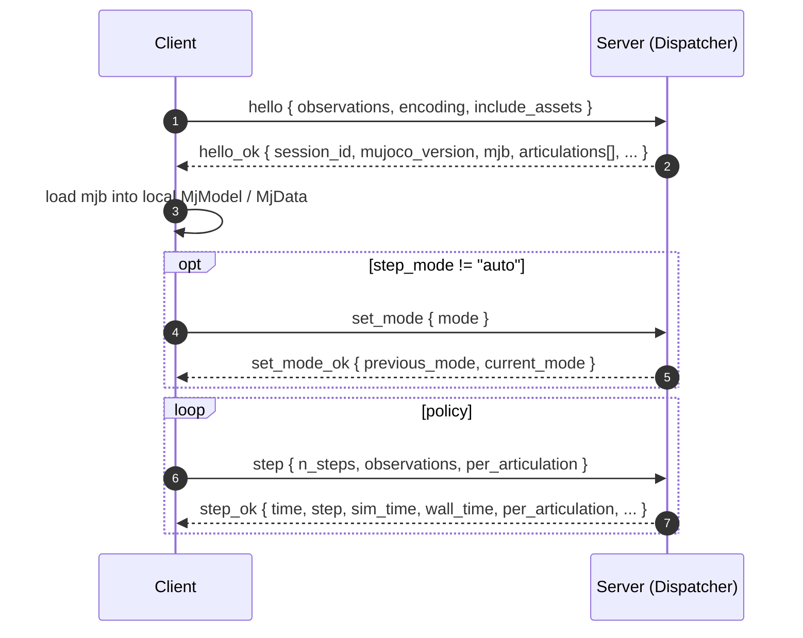

# Protocol Reference

The wire protocol URLab's step server speaks: the handshake, the
step / reset loop, the runtime mutators, and recording / replay. This
is the authoritative op and error catalogue, enumerated from the
dispatcher source.

Most users never touch the wire directly; the
[Python client](../python/api.md) wraps every op. Reach for this page
when you write your own client, debug a frame, or need the exact error
codes.

## Transports

The same wire shape rides two transports:

| Transport | Channels | Use |
|---|---|---|
| ZMQ | REQ/REP `tcp:5559` (RPC), PUB `tcp:5555` (state), PUB `tcp:5558+` (per camera) | Default. Cross-host. |
| SHM | `req.shm` / `rep.shm` (RPC), `state.shm`, `cam_<prefix>_<name>.shm` | Same-host, lower jitter. Falls back to ZMQ for the handshake and oversize ops. |

SHM files live under `<ProjectSavedDir>/URLabShm/<session_id>/`. The
absolute directory comes from the handshake's `shm_session_dir`.

## Wire encoding

Frames are **msgpack by default**. The server encodes from an internal
JSON-object tree; the Python client decodes with the C-extension
`msgpack` package. Binary blobs (the compiled model, camera frames,
asset bytes) ship as msgpack `bin`.

Every payload below is shown as JSON for readability; the real frame is
the equivalent binary msgpack.

### JSON fallback

For debugging, request human-readable JSON for the rest of the session
by passing `"encoding": "json"` in `hello`:

```json
{ "op": "hello", "observations": "standard", "encoding": "json" }
```

The server resets to msgpack on each new `hello`; the JSON opt-in is
per session. Under JSON, binary fields also ship base64-encoded
companions (for example `mjb_base64` alongside `mjb`).

## Session lifecycle



`hello` and `meta` are the only pre-session ops. Every other request
carries the `session_id` from `hello_ok`; a mismatch returns
`session_expired`.

## `hello`

Bootstrap handshake. Establishes the session, selects encoding and
observation level, and ships the compiled model.

Request:

```json
{
  "op": "hello",
  "observations": "standard",
  "include_assets": false
}
```

Reply (`hello_ok`), notable fields:

```json
{
  "op": "hello_ok",
  "session_id": "uuid-v4",
  "urlab_version": "urlab/A.B.C",
  "mujoco_version": "3.x.y",
  "mujoco_version_int": 3xy,
  "manager_present": true,
  "shm_session_dir": "C:/.../Saved/URLabShm/<session_id>",
  "mjb": "<bytes>",
  "articulations": [ ... ],
  "entities": { ... },
  "global_cameras": {}
}
```

- `mujoco_version` is set at runtime from `mj_versionString()`;
  `mujoco_version_int` from `mj_version()`. Neither is hardcoded.
  Compare against your local `mujoco.__version__` and refuse on
  mismatch.
- `manager_present` is `false` for an editor-time handshake (no PIE).
  In that case `articulations` is an empty array and the PIE-only
  blocks are omitted; only editor-only ops will run until PIE starts.
- `mjb` is the compiled MuJoCo binary as msgpack `bin` (plus
  `mjb_base64` / `mjb_size` for JSON clients). Load it via a temp-file
  round-trip into `mujoco.MjModel`.
- `shm_session_dir` is the absolute SHM region directory.

### Articulations block

Per articulation, the handshake ships only what the model binary
cannot carry: the default control mode, the controller config, the
authored actuator kinds, the original-name maps, and camera metadata.
Joint names, ranges, offsets, and body data all round-trip through the
model.

```json
{
  "prefix": "g1",
  "actor_id": "robot_0",
  "default_control_mode": "ue_controller",
  "controller": {
    "kind": "pd",
    "params": { "...": "..." },
    "schema": { "...": "..." }
  },
  "actuator_types": { "left_hip_pitch": "position" },
  "original_names": {
    "actuators": { "live_name": "original_xml_name" },
    "joints": {}, "sensors": {}, "bodies": {}
  },
  "camera_topics": {
    "head_rgbd": {
      "mode": "depth",
      "resolution": [848, 480],
      "fovy": 58.0,
      "zmq_endpoint": "tcp://127.0.0.1:5558",
      "zmq_topic": "g1/camera/head_rgbd"
    }
  }
}
```

`default_control_mode` is `ue_controller` when a controller component
is attached, else `raw`. The `controller` block appears only when one
is attached. `actuator_types` carries the authored MuJoCo kind, which
the model loses (all kinds compile to `<general>`). `original_names`
maps live (possibly UE-renamed) names back to the source XML names per
category. Camera `mode` is `real` / `depth` / `semantic` / `instance`.

### Entities block

Non-articulation dynamic bodies, keyed by name:

```json
"entities": {
  "pallet": {
    "id": 12,
    "has_free_base": true,
    "free_joint": "pallet_free",
    "free_joint_id": 3,
    "qpos_offset": 7,
    "qvel_offset": 6
  }
}
```

`free_joint` / `free_joint_id` / `qpos_offset` / `qvel_offset` appear
only for free-base bodies, so a puppet-mode client can write the right
slots.

### `include_assets`

Opt-in (the payload can be tens of MB). When `hello` requests
`"include_assets": true`, `hello_ok` also carries:

- `mjcf_compiled` - the model re-serialised to XML, with mesh `file=`
  references flattened to bare filenames so a filename-keyed VFS can
  resolve them.
- `vfs_assets` - one msgpack `bin` field per referenced asset file
  (meshes, textures), keyed by bare filename.

This lets a client reload the model fully offline, for MJX, a different
MuJoCo build, or a headless renderer.

## `meta`

Pre-session op that returns the live op catalogue, so a client can
synthesise its method bindings at discover time.

```json
{ "op": "meta" }

{
  "op": "meta_ok",
  "ops": [
    { "name": "step", "category": "manager_required", "namespace": "",
      "reply_fields": ["op:string", "time:float", "..."] },
    { "name": "import_xml", "category": "editor_only", "namespace": "scene",
      "required_fields": ["path"] }
  ]
}
```

Each entry carries `name`, `category` (`editor_only`,
`manager_required`, or `no_manager`), `namespace`, and the
`required_fields` / `reply_fields` declared at registration.

## `step`

Advances physics and returns observations. The request shape varies
with the active step mode.

### Direct

```json
{
  "op": "step",
  "session_id": "uuid-v4",
  "n_steps": 10,
  "observations": "standard",
  "include_cameras": false,
  "per_articulation": {
    "g1": {
      "ctrl": [0.5, -0.2, 0, "..."],
      "control_mode": "ue_controller",
      "xfrc_applied": { "left_foot": [0, 5, 0, 0, 0, 0] }
    }
  }
}
```

`ctrl` is a positional array in actuator order; `ctrl_map`
(`{name: value}`) is the named alternative. `control_mode` is optional
and falls back to the handshake's `default_control_mode`; `"raw"`
bypasses the UE controller for that articulation this step.
`xfrc_applied` is a one-shot impulse cleared after the step window.
With `ue_controller`, the inner loop runs every sub-step of the
`n_steps` window against the fixed setpoint.

### Puppet

```json
{
  "op": "step",
  "session_id": "uuid-v4",
  "n_steps": 1,
  "time": 0.042,
  "qpos": ["..."],
  "qvel": ["..."],
  "ctrl": ["..."]
}
```

`qpos` / `qvel` are full `nq` / `nv` vectors written into the live
data; `ctrl` is optional and stored for visualisation. The server runs
`mj_forward` once (no integration). `xfrc_applied` is inert. The reply
may add a `perturbation` block carrying the editor click-drag widget's
force so the client can apply it to its own data.

### Live

`step` applies the per-articulation ctrl and reads back current state;
`n_steps` is ignored because UE drives its own physics rate. The
request uses the same `per_articulation` shape as direct.

### Reply

`step_ok`, the same shape across modes:

```json
{
  "op": "step_ok",
  "time": 0.042,
  "step": 21,
  "sim_time": { "sec": 0, "nsec": 42000000 },
  "wall_time": { "sec": 1714125000, "nsec": 123000000 },
  "per_articulation": {
    "g1": {
      "qpos": ["..."], "qvel": ["..."], "ctrl": ["..."], "act": ["..."],
      "sensors": { "imu_gyro": ["..."] },
      "twist": { "linear": [0,0,0], "angular": [0,0,0] },
      "actions": 0
    }
  },
  "entities": {
    "pallet":    { "qpos": ["..."], "qvel": ["..."], "xpos": ["..."], "xquat": ["..."] },
    "terrain_a": { "xpos": ["..."], "xquat": ["..."] }
  }
}
```

- `time` is `mjData->time`. `sim_time` / `wall_time` are
  ROS-Time-aligned `{sec, nsec}` blocks: `sim_time` mirrors `time` at
  nanosecond precision, `wall_time` is the publish moment in unix
  epoch. Use them for `header.stamp` and latency measurement.
- `twist` / `actions` appear only when the articulation has a
  `UMjTwistController`: `twist.linear` carries `(vx, vy, 0)`,
  `twist.angular` carries `(0, 0, yaw_rate)`; `actions` is a discrete
  bitfield.
- The fields present per articulation follow the observation level (see
  [Observation levels](#observation-levels)).

### Camera observations

When `include_cameras` is non-false, the reply gains a `cameras` block:

```json
"cameras": {
  "head_rgbd": { "width": 848, "height": 480, "dtype": "float32", "data": "<bytes>" },
  "wrist_rgb": { "width": 640, "height": 480, "dtype": "bgra8",   "data": "<bytes>" }
}
```

`dtype` is `bgra8` (4 bytes/pixel) for Real / Semantic / Instance and
`float32` for Depth. The bridge swaps Real to RGBA on receive and keeps
seg modes BGRA so consumers can map color to class id.

`include_cameras` accepts `true` (every camera, latest cached frame),
`false`, or a per-camera object like `{"head_rgbd": "sync"}`. `"sync"`
blocks the step until UE captures a fresh frame; `"latest"` returns the
cached one.

## `reset`

```json
{
  "op": "reset",
  "session_id": "uuid-v4",
  "keyframe_name": "home",
  "seed": 42,
  "per_articulation_qpos": { "g1": { "left_hip_pitch": 0.3 } }
}
```

All three override fields are optional.

- `keyframe_name` is resolved with `mj_name2id` (key namespace) and
  applied with `mj_resetDataKeyframe`. An unknown name returns
  `unknown_keyframe`. With no keyframe, the server calls `mj_resetData`.
- `seed` is recorded on the manager's `Seed` field for reproducibility
  bookkeeping. It is **not** written into `mjOption`; modern `mjOption`
  has no seed field, and `mj_step` carries no integrator-internal RNG.
  Determinism in `direct` mode comes from the integrator itself, not
  from a pushed seed.
- `per_articulation_qpos` overrides specific joints by name.

The server then runs `mj_forward` once. The reply is `reset_ok`, the
same shape as `step_ok`.

## `forward`

Runs `mj_forward` (kinematics + dynamics, no integration) and returns
observations. Lets a client write `qpos` / `qvel`, then read consistent
derived state (xpos, sensors) without advancing time. Reply is
`forward_ok`.

## Runtime mutators

All require an active manager (PIE). Each replies `<op>_ok`.

### `set_mode`

Switch `live` / `direct` / `puppet` mid-session. Allowed only when the
project left `StepMode` at `Auto`.

```json
{ "op": "set_mode", "session_id": "uuid-v4", "mode": "direct" }
{ "op": "set_mode_ok", "previous_mode": "live", "current_mode": "direct" }
```

Errors `mode_locked_by_server` if the project pinned a mode, or
`bad_mode` on an unknown mode string.

### `set_paused`

```json
{ "op": "set_paused", "session_id": "uuid-v4", "paused": true }
{ "op": "set_paused_ok", "paused": true }
```

### `set_sim_speed`

```json
{ "op": "set_sim_speed", "session_id": "uuid-v4", "percent": 25.0 }
{ "op": "set_sim_speed_ok", "percent": 25.0 }
```

The engine clamps to `[5, 100]`; the reply echoes the effective value.
Affects live pacing only.

### `set_control_source`

```json
{ "op": "set_control_source", "session_id": "uuid-v4", "source": "zmq" }
{ "op": "set_control_source_ok", "source": "zmq", "scope": "global" }
```

Flips the actuator-read source between `"zmq"` (what the bridge writes)
and `"ui"` (what the editor Details panel writes). With an
`"articulation"` field, only that articulation flips (`scope:
"articulation"`); without it, everything. An unknown source returns
`bad_value`.

### `set_twist`

```json
{ "op": "set_twist", "session_id": "uuid-v4", "articulation": "go2",
  "linear": [0.4, 0, 0], "angular": [0, 0, 0.5] }
```

Injects into the articulation's `UMjTwistController`. `linear[0:2]` map
to vx/vy (m/s); `angular[2]` maps to yaw rate (rad/s); other slots are
ignored. Errors `no_twist_controller` if none is attached.

### `set_qpos`

Writes one articulation's qpos. Two modes: a free-base 7-vector
shortcut (`len == 7` and the first joint is a free joint) writes just
the free-joint slots; otherwise the length must match the
articulation's total qpos dim. Runs `mj_forward` after the write.

```json
{ "op": "set_qpos", "session_id": "uuid-v4",
  "target": "robot_0", "qpos": ["..."] }
```

`target` resolves by `actor_id` by default, or by UE name with
`"target_by": "actor_name"`. A length that is neither 7-with-free-root
nor the full dim returns `dim_mismatch`.

### `set_mocap_pose` / `read_mocap_pose`

```json
{ "op": "set_mocap_pose", "session_id": "uuid-v4",
  "body": "g1_target", "pos": [0,0,1], "quat": [1,0,0,0] }
```

Operate on the compiled MJ body name. `pos` is MJ metres, `quat` is
wxyz. At least one of `pos` / `quat` is required for a write. Errors
`unknown_body` if the name does not resolve, `not_mocap_body` if the
body is not a mocap body.

### `get_contacts`

```json
{ "op": "get_contacts", "session_id": "uuid-v4",
  "max_contacts": 64, "filter": { "body1": "foot_l" } }
```

Snapshots active MuJoCo contacts. The optional `filter`
(`body1` / `body2` / `geom1` / `geom2`) AND-matches exact compiled
names. The reply caps at `max_contacts` (default 64) with a
`truncated` flag. Per-contact `force` is the 6-vector
`[fx, fy, fz, tx, ty, tz]` from `mj_contactForce` in the contact frame;
`normal` is the first row of the contact frame; `dist` is negative when
penetrating.

### `list_keyframes`

```json
{ "op": "list_keyframes", "session_id": "uuid-v4" }
```

Enumerates `<keyframe>` entries compiled into the model. Each carries
`name`, `time`, and `qpos[nq]` / `qvel[nv]` / `ctrl[nu]` /
`mocap_pos[3*nmocap]` / `mocap_quat[4*nmocap]` in compiled order. Pair
with `reset(keyframe_name=...)` to load one.

### `configure_controller`

Patches the active controller. Same UE path as the editor and the
streaming `set_gains` topic.

```json
{ "op": "configure_controller", "session_id": "uuid-v4",
  "articulation": "g1",
  "params": { "kp": { "left_hip_pitch": 320.0 }, "default_kv": 6.0 } }
```

Partial payloads are allowed; unmentioned fields are untouched. The
reply echoes the full current config. Errors `unknown_articulation`,
`no_controller`, or `controller_schema_violation`.

### `set_sim_options`

Pushes overrides into the live model options; partial payloads override
only the listed fields. The reply echoes the resulting `opt` so callers
can verify.

```json
{ "op": "set_sim_options", "session_id": "uuid-v4",
  "options": { "timestep": 0.002, "gravity": [0, 0, -9.81], "integrator": "implicitfast" } }
```

Values use MuJoCo-native SI: timestep in seconds, gravity / wind in
m/s^2, magnetic in gauss. Accepted fields: `timestep`, `gravity`,
`wind`, `magnetic`, `density`, `viscosity`, `impratio`, `tolerance`,
`iterations`, `ls_iterations`, `integrator` (`euler` / `rk4` /
`implicit` / `implicitfast`), `cone` (`pyramidal` / `elliptic`),
`solver` (`pgs` / `cg` / `newton`), `noslip_iterations`,
`noslip_tolerance`, `ccd_iterations`, `ccd_tolerance`,
`enable_multiccd`, `enable_sleep`, `sleep_tolerance`, plus the raw
`disableflags` / `enableflags` masks and `num_worker_threads`. An
unknown integrator / cone / solver string returns `bad_value`.

## Recording

Hooks the post-step path, capturing one frame per `mj_step` regardless
of mode. Recordings save as `.json`.

```json
{ "op": "recording_start", "session_id": "uuid-v4", "name": "ep_1234", "max_duration_s": 3600 }
{ "op": "recording_start_ok", "name": "live", "max_duration_s": 3600 }

{ "op": "recording_stop", "session_id": "uuid-v4" }
{ "op": "recording_stop_ok", "name": "live", "frame_count": 2048, "sim_duration_s": 4.096 }

{ "op": "recording_save", "session_id": "uuid-v4", "path": "ep_1234.json" }
{ "op": "recording_save_ok", "absolute_path": "C:/.../Saved/URLab/Replays/ep_1234.json" }

{ "op": "recording_clear", "session_id": "uuid-v4" }
{ "op": "recording_clear_ok" }
```

A bare filename resolves under `<Project>/Saved/URLab/Replays/`; an
absolute path passes through. The reply always returns the resolved
absolute path. Errors: `recording_already_active`,
`recording_not_active`, `path_not_writable`. All four require an
`AMjReplayManager` in the scene (else `not_ready`).

## Replay

Plays a saved `.json` recording through the same post-step path.
Requires `direct` or `puppet`.

```json
{ "op": "replay_load", "session_id": "uuid-v4", "path": "ep_1234.json" }
{ "op": "replay_load_ok", "name": "ep_1234" }

{ "op": "replay_list_sessions", "session_id": "uuid-v4" }
{ "op": "replay_list_sessions_ok", "sessions": ["live", "ep_1234"] }

{ "op": "replay_set_active", "session_id": "uuid-v4", "name": "ep_1234" }
{ "op": "replay_set_active_ok" }

{ "op": "replay_start", "session_id": "uuid-v4" }
{ "op": "replay_start_ok", "active_session": "ep_1234", "total_frames": 2048 }

{ "op": "replay_stop", "session_id": "uuid-v4" }
{ "op": "replay_stop_ok" }
```

Errors: `path_not_readable`, `replay_session_not_found`,
`replay_requires_stepped` (issued while in `live`).

## Editor ops

Editor-only ops (category `editor_only`) share the same envelope and
encoding. They are valid before PIE and run on the editor game thread.
Their wire names mirror the Python methods; see
[API Reference](../python/api.md) for each one's contract.

- `scene`: `import_xml`, `create_level`, `load_level`, `save_level`,
  `current_level`, `ensure_manager`, `spawn_actor`, `spawn_grid`,
  `spawn_light`, `destroy_actor`, `destroy_asset`,
  `set_actor_transform`, `duplicate_actor`, `actor_hierarchy`,
  `snapshot`.
- `sim` (PIE lifecycle): `begin_pie`, `stop_pie`, `pie_status`.
- `outliner`: `list_actors`, `list_blueprints`, `find_actors`,
  `get_actor_bounds`, `select_actor`, `add_quick_convert`,
  `remove_quick_convert`.
- `debug`: `draw_marker`, `draw_line`, `draw_box`, `draw_arrow`,
  `draw_axes`, `clear_markers`, `set_overlay_text`.
- `viewport`: `set_camera`, `get_camera`, `frame_actor`,
  `set_viewport_mode`, `track_actor`, `untrack`.

`begin_pie` returns a `state` enum (`off` / `compiling` /
`compile_failed` / `timeout` / `ready`) plus a `compile_error` string,
and on `ready` embeds a fresh handshake-shaped `handshake_payload` so
the client re-discovers without an extra `hello`.

## Errors

A failed request returns:

```json
{ "op": "error", "code": "...", "message": "..." }
```

Codes raised by the dispatcher and op handlers:

| Code | Meaning |
|---|---|
| `bad_request` | Frame failed to parse as JSON or msgpack. |
| `missing_op` | Request had no `op` field. |
| `unknown_op` | No handler registered for the op. |
| `not_in_editor` | Editor-only op invoked with no registered handler for the current state. |
| `no_active_manager` | A manager-required op was issued with no active manager (PIE not running). |
| `session_expired` | `session_id` does not match the active session. |
| `missing_field` | A declared required field was absent. |
| `not_ready` | The physics engine / model / data was not initialised. |
| `bad_mode` | `set_mode` got an unknown mode string. |
| `bad_value` | An enum-valued field (source, integrator, cone, solver) was unknown. |
| `unknown_articulation` | The named articulation does not resolve. |
| `unknown_body` | `mj_name2id` did not resolve the body. |
| `not_mocap_body` | The target body is not flagged as a mocap body. |
| `unknown_keyframe` | `reset` keyframe name did not resolve. |
| `dim_mismatch` | `set_qpos` length matched neither the free-base shortcut nor the full qpos dim. |
| `no_joints` | `set_qpos` target articulation has no joints. |
| `no_twist_controller` | `set_twist` target has no `UMjTwistController`. |
| `no_controller` | `configure_controller` target has no controller. |
| `controller_schema_violation` | `params` failed the controller's schema. |
| `mode_locked_by_server` | `set_mode` issued while the project pinned `StepMode`. |
| `recording_already_active` | `recording_start` while one was active. |
| `recording_not_active` | `recording_stop` / `save` with none active. |
| `path_not_writable` | `recording_save` target not writable. |
| `path_not_readable` | `replay_load` source not readable. |
| `replay_session_not_found` | `set_active` / `start` named an unloaded session. |
| `replay_requires_stepped` | `replay_start` issued while in `live`. |
| `step_timeout` | A direct-mode step did not complete within 5 s. |
| `shutting_down` | The bridge began draining mid-op (server stop / editor close). |

Editor ops add their own per-op failure codes (for example
`import_failed`, `create_level_failed`, `spawn_failed`, `no_viewport`,
`unknown_actor`); the `message` carries the detail.

## Observation levels

The `observations` field on `hello` and `step` selects how much per-step
payload the server serialises. The server pays only for what is asked.

| Level | Per-articulation content |
|---|---|
| `minimal` | `qpos`, `qvel` (plus `time`, `step`, `sim_time`, `wall_time` at the top level) |
| `standard` | `minimal` + `ctrl` + `act` + `sensors` by name (+ `twist` / `actions` when a twist controller is attached) |
| `full` | `standard` + body `xpos` / `xquat` + actuator forces |

## See also

- [API Reference](../python/api.md) - the client wrappers.
- [Quickstart](../python/quickstart.md) - the guided flow.
